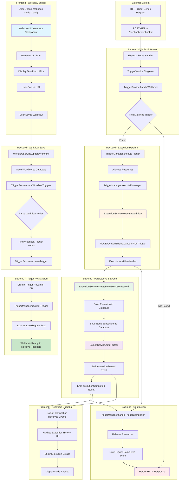
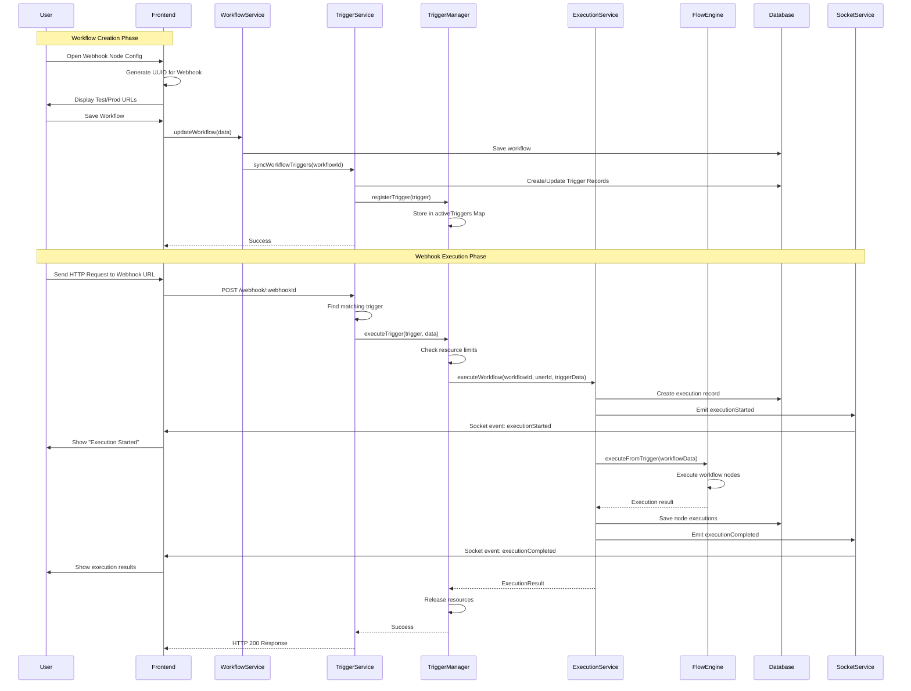
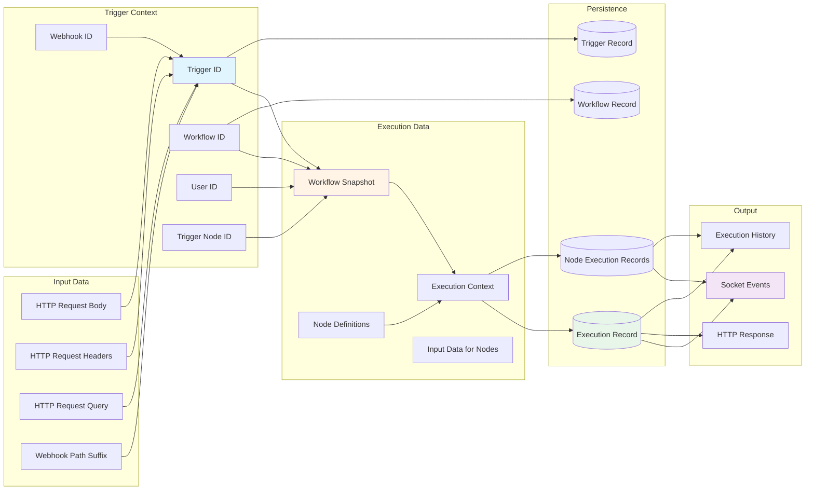
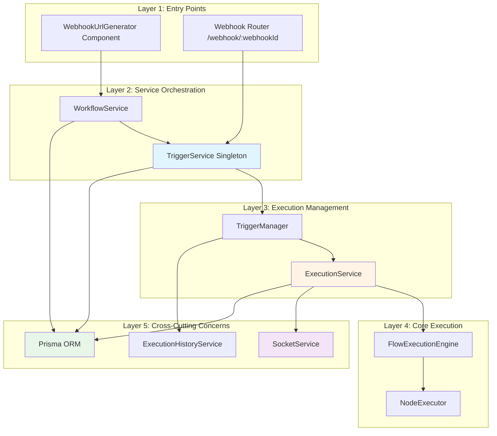
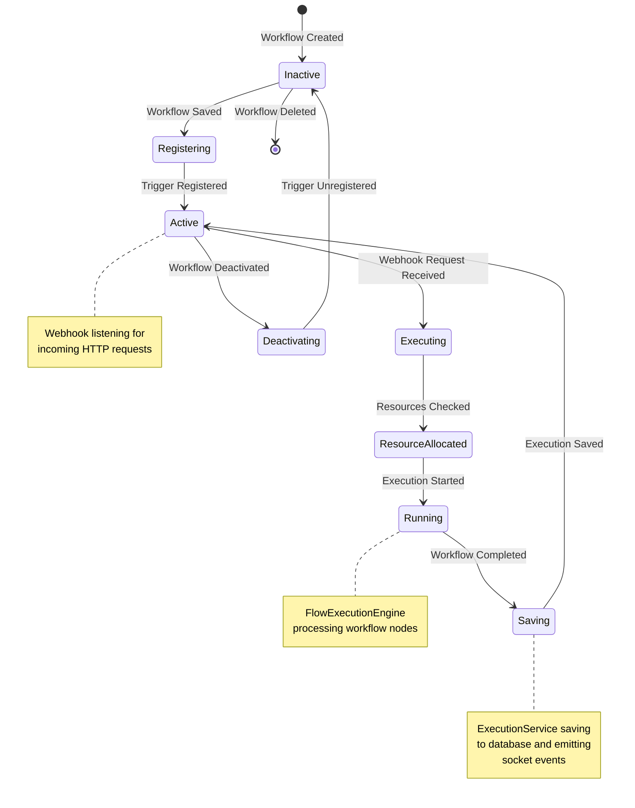
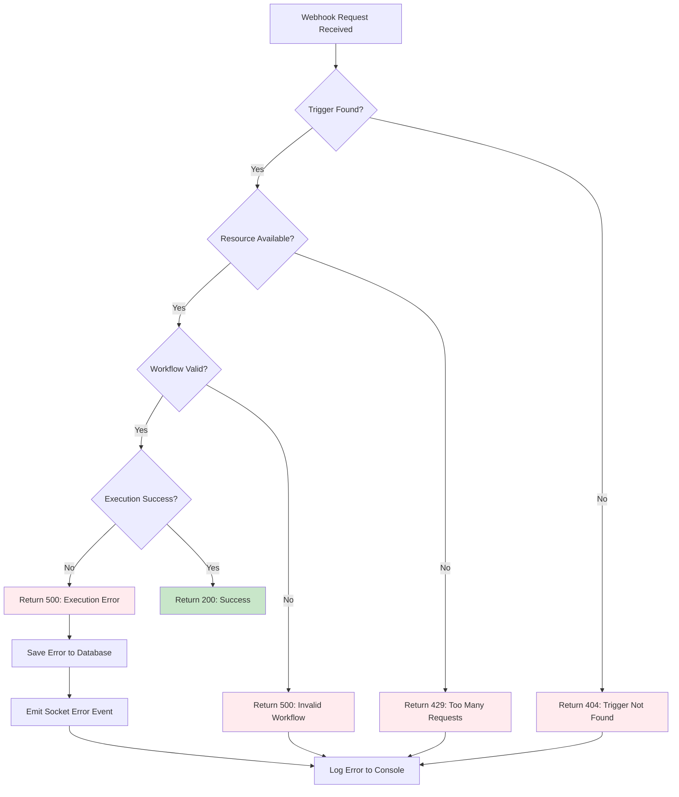

# Webhook System Flow Diagram

## Overview

This document provides a comprehensive visual representation of how webhooks work in the node-drop system, from URL generation in the frontend to execution and persistence in the backend.

---

## 1. Complete Webhook Flow

---

## 2. Component Interaction Diagram

---

## 3. Data Flow Diagram

---

## 4. Architecture Layers

---

## 5. State Transitions

---

## 6. Error Handling Flow

---

## Key Design Decisions

### 1. **Singleton Pattern for TriggerService**

- **Why**: Ensures single instance manages all triggers across the application
- **Benefit**: Prevents duplicate trigger registrations and resource conflicts

### 2. **ExecutionService Reuse**

- **Why**: Eliminates code duplication between manual and webhook executions
- **Benefit**: Automatic database persistence, socket events, and execution history

### 3. **TriggerManager Resource Management**

- **Why**: Prevents system overload from concurrent webhook executions
- **Benefit**: Configurable limits, queuing, and conflict resolution strategies

### 4. **Automatic Trigger Sync**

- **Why**: Ensures triggers are registered immediately when workflows are saved
- **Benefit**: No manual trigger registration required, immediate webhook availability

---

## Execution Path Comparison

| Feature           | Manual Execution (Frontend)        | Webhook Execution (Trigger)        |
| ----------------- | ---------------------------------- | ---------------------------------- |
| Entry Point       | Frontend UI Button                 | HTTP POST to /webhook/:id          |
| Service           | ExecutionService.executeWorkflow() | ExecutionService.executeWorkflow() |
| Engine            | FlowExecutionEngine                | FlowExecutionEngine                |
| DB Persistence    | ✅ Automatic                       | ✅ Automatic                       |
| Socket Events     | ✅ Automatic                       | ✅ Automatic                       |
| Execution History | ✅ Saved                           | ✅ Saved                           |
| Resource Limits   | None                               | ✅ TriggerManager                  |
| Code Path         | **Identical**                      | **Identical**                      |

---

## Related Documentation

- [Webhook URL Generator Implementation](../WEBHOOK_URL_GENERATOR_IMPLEMENTATION.md)
- [Webhook Execution Service Refactor](../WEBHOOK_EXECUTION_SERVICE_REFACTOR.md)
- [Trigger Service Architecture](./TRIGGER_SERVICE_ARCHITECTURE.md)
- [Execution Service Design](./EXECUTION_SERVICE_DESIGN.md)

---

## Future Enhancements

1. **Webhook Response Customization**: Allow users to define custom HTTP responses
2. **Webhook Authentication**: Add support for API keys, signatures, OAuth
3. **Webhook Retry Logic**: Implement automatic retries for failed webhooks
4. **Webhook Analytics**: Track webhook usage, response times, error rates
5. **Webhook Rate Limiting**: Per-webhook rate limits to prevent abuse
6. **Webhook Versioning**: Support multiple versions of the same webhook

---

**Last Updated**: October 10, 2025  
**Author**: System Architecture Team  
**Version**: 1.0.0
