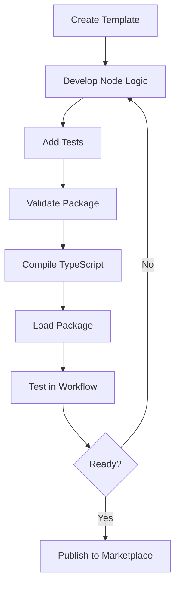

# Custom Node Development System

## Overview

The Custom Node Development System provides a complete toolkit for creating, managing, and distributing custom nodes for the node drop platform. This system includes both backend services and a frontend interface for seamless node development and deployment.

## Table of Contents

- [Architecture](#architecture)
- [Backend Components](#backend-components)
- [Frontend Components](#frontend-components)
- [Getting Started](#getting-started)
- [Development Workflow](#development-workflow)
- [API Reference](#api-reference)
- [CLI Tools](#cli-tools)
- [Testing](#testing)
- [Deployment](#deployment)

## Architecture

The custom node system follows a modular architecture with clear separation between backend services and frontend interface:

```
┌─────────────────────────────────────────────────────────────┐
│                    Frontend (React)                        │
├─────────────────────────────────────────────────────────────┤
│  CustomNodesPage │ NodeMarketplace │ TemplateGenerator     │
│  PackageValidator │ CustomNodeList  │ Zustand Store        │
└─────────────────────────────────────────────────────────────┘
                              │
                              │ HTTP API
                              │
┌─────────────────────────────────────────────────────────────┐
│                    Backend (Node.js)                       │
├─────────────────────────────────────────────────────────────┤
│  NodeLoader      │ NodeTemplateGenerator │ NodeMarketplace │
│  NodeService     │ CLI Tools             │ API Routes      │
└─────────────────────────────────────────────────────────────┘
                              │
                              │
┌─────────────────────────────────────────────────────────────┐
│                    Storage & Runtime                       │
├─────────────────────────────────────────────────────────────┤
│  File System     │ Database (Prisma)     │ Hot Reload      │
│  Custom Nodes    │ Node Registry         │ TypeScript      │
└─────────────────────────────────────────────────────────────┘
```

## Backend Components

### 1. NodeLoader (`backend/src/services/NodeLoader.ts`)

The core service responsible for dynamically loading and managing custom node packages.

**Key Features:**
- Dynamic package loading and unloading
- Package validation and compilation
- Hot-reload support for development
- TypeScript compilation
- File watching for automatic reloads

**Usage:**
```typescript
const nodeLoader = new NodeLoader(nodeService, prisma, customNodesPath);
await nodeLoader.initialize();

// Load a package
const result = await nodeLoader.loadNodePackage('/path/to/package');

// Validate a package
const validation = await nodeLoader.validateNodePackage('/path/to/package');
```

### 2. NodeTemplateGenerator (`backend/src/services/NodeTemplateGenerator.ts`)

Generates new node packages from templates with customizable options.

**Supported Node Types:**
- **Action Nodes**: Perform operations on data
- **Trigger Nodes**: Start workflows based on events
- **Transform Nodes**: Modify and transform data

**Template Options:**
```typescript
interface NodeTemplateOptions {
  name: string;
  displayName: string;
  description: string;
  type: 'action' | 'trigger' | 'transform';
  author?: string;
  version?: string;
  group?: string[];
  includeCredentials?: boolean;
  includeTests?: boolean;
  typescript?: boolean;
}
```

### 3. NodeMarketplace (`backend/src/services/NodeMarketplace.ts`)

Handles marketplace integration for discovering, installing, and publishing nodes.

**Features:**
- Search and filter nodes
- Install packages from marketplace
- Publish custom nodes
- Version management
- Package metadata handling

### 4. CLI Tools (`backend/src/cli/node-cli.ts`)

Command-line interface for node development and management.

**Available Commands:**
```bash
# Create a new node
npm run node-cli create -n my-node -d "My Custom Node" -t action

# Validate a package
npm run node-cli validate /path/to/package

# Build TypeScript package
npm run node-cli build /path/to/package

# Test a node
npm run node-cli test /path/to/package

# Development mode with hot reload
npm run node-cli dev /path/to/package
```

## Frontend Components

### 1. CustomNodesPage (`frontend/src/pages/CustomNodesPage.tsx`)

Main interface for custom node management with tabbed navigation:

- **Installed Nodes**: View and manage loaded packages
- **Marketplace**: Discover and install new nodes
- **Create Node**: Generate new node packages
- **Validate Package**: Test and validate packages

### 2. Component Architecture

```
CustomNodesPage
├── CustomNodeList
│   ├── Package display with metadata
│   ├── Reload/Unload actions
│   └── Empty state handling
├── NodeMarketplace
│   ├── Search and filtering
│   ├── Package browsing
│   ├── Installation interface
│   └── Package details sidebar
├── NodeTemplateGenerator
│   ├── Template configuration form
│   ├── Node type selection
│   ├── Options configuration
│   └── Generation results
└── PackageValidator
    ├── Path input
    ├── Validation actions
    ├── Compilation support
    └── Results display
```

### 3. State Management

Uses Zustand for global state management:

```typescript
const {
  packages,
  loading,
  error,
  loadPackages,
  validatePackage,
  loadPackage,
  generatePackage
} = useCustomNodeStore();
```

## Getting Started

### Prerequisites

- Node.js >= 18.0.0
- npm or yarn
- TypeScript (for TypeScript nodes)

### Installation

1. **Backend Setup:**
```bash
cd backend
npm install
npm run build
```

2. **Frontend Setup:**
```bash
cd frontend
npm install
npm run build
```

### Creating Your First Custom Node

1. **Using the CLI:**
```bash
npm run node-cli create \
  --name "my-first-node" \
  --display-name "My First Node" \
  --description "A simple custom node" \
  --type "action" \
  --typescript \
  --tests
```

2. **Using the Web Interface:**
   - Navigate to `/custom-nodes`
   - Click on "Create Node" tab
   - Fill in the form with your node details
   - Click "Generate Package"

3. **Package Structure:**
```
my-first-node/
├── package.json
├── tsconfig.json
├── README.md
├── .gitignore
├── nodes/
│   └── my-first-node.node.ts
├── credentials/
│   └── my-first-node.credentials.ts
└── __tests__/
    └── my-first-node.test.ts
```

## Development Workflow

### 1. Node Development Lifecycle



### 2. Hot Reload Development

Enable hot reload for rapid development:

```bash
# Start development mode
npm run node-cli dev /path/to/your/node

# Or set NODE_ENV=development
NODE_ENV=development npm run dev
```

### 3. Testing Your Node

```bash
# Run unit tests
npm run node-cli test /path/to/your/node

# Test with custom input data
npm run node-cli test /path/to/your/node \
  --input ./test-data.json \
  --params '{"operation": "process"}'
```

## API Reference

### Custom Nodes API Endpoints

#### Package Management

```http
GET /api/custom-nodes/packages
POST /api/custom-nodes/packages/validate
POST /api/custom-nodes/packages/load
POST /api/custom-nodes/packages/:packageName/reload
```

#### Template Generation

```http
POST /api/custom-nodes/generate
```

#### Compilation

```http
POST /api/custom-nodes/compile
```

#### Marketplace

```http
GET /api/custom-nodes/marketplace/search
GET /api/custom-nodes/marketplace/packages/:packageId
POST /api/custom-nodes/marketplace/install
POST /api/custom-nodes/marketplace/publish
```

### Request/Response Examples

#### Load Package
```http
POST /api/custom-nodes/packages/load
Content-Type: application/json

{
  "packagePath": "/path/to/custom-node-package"
}
```

Response:
```json
{
  "success": true,
  "data": {
    "success": true,
    "nodeType": "my-custom-node",
    "warnings": []
  }
}
```

#### Generate Package
```http
POST /api/custom-nodes/generate
Content-Type: application/json

{
  "name": "my-node",
  "displayName": "My Node",
  "description": "A custom node",
  "type": "action",
  "typescript": true,
  "includeTests": true
}
```

## CLI Tools

### Installation

The CLI is automatically available after backend installation:

```bash
npm run node-cli --help
```

### Commands Reference

#### create
Create a new node package from template.

```bash
npm run node-cli create [options]

Options:
  -n, --name <name>           Node name (required)
  -d, --display-name <name>   Display name for the node
  --description <desc>        Node description
  -t, --type <type>          Node type (action, trigger, transform)
  -a, --author <author>      Author name
  -v, --version <version>    Node version (default: 1.0.0)
  -g, --group <group>        Node group (comma-separated)
  --credentials              Include credentials template
  --tests                    Include test files (default: true)
  --typescript               Use TypeScript (default: true)
  -o, --output <path>        Output directory (default: current)
```

#### validate
Validate a node package structure.

```bash
npm run node-cli validate <path>
```

#### build
Compile a TypeScript node package.

```bash
npm run node-cli build <path>
```

#### test
Test a node with sample data.

```bash
npm run node-cli test <path> [options]

Options:
  -i, --input <file>         Input data file (JSON)
  -p, --params <params>      Node parameters (JSON)
  -c, --credentials <creds>  Credentials (JSON)
```

#### install
Install a node package.

```bash
npm run node-cli install <path>
```

#### dev
Start development mode with hot reload.

```bash
npm run node-cli dev <path>
```

## Testing

### Backend Tests

```bash
cd backend
npm test
```

**Test Categories:**
- Unit tests for core services
- Integration tests for complete workflows
- CLI tool tests
- Package validation tests

### Frontend Tests

```bash
cd frontend
npm test
```

**Test Categories:**
- Component unit tests
- Service layer tests
- Integration tests
- User interaction tests

### Example Node Test

```typescript
describe('MyCustomNode', () => {
  it('should process data correctly', async () => {
    const inputData = {
      main: [[{ json: { test: 'data' } }]]
    };

    const result = await MyCustomNode.execute.call(mockContext, inputData);

    expect(result).toBeDefined();
    expect(result[0].main).toHaveLength(1);
    expect(result[0].main[0].json.processed).toBe(true);
  });
});
```

## Deployment

### Production Setup

1. **Build the application:**
```bash
# Backend
cd backend
npm run build

# Frontend
cd frontend
npm run build
```

2. **Environment Variables:**
```env
# Backend
NODE_ENV=production
CUSTOM_NODES_PATH=/app/custom-nodes
NODE_MARKETPLACE_URL=https://marketplace.example.com
NODE_MARKETPLACE_API_KEY=your-api-key

# Frontend
VITE_API_URL=https://api.example.com
```

3. **Docker Deployment:**
```dockerfile
# Backend Dockerfile
FROM node:18-alpine
WORKDIR /app
COPY package*.json ./
RUN npm ci --only=production
COPY dist ./dist
EXPOSE 4000
CMD ["npm", "start"]
```

### Custom Nodes Directory Structure

```
/app/custom-nodes/
├── package-1/
│   ├── package.json
│   ├── nodes/
│   └── credentials/
├── package-2/
│   ├── package.json
│   └── nodes/
└── marketplace-cache/
    └── downloaded-packages/
```

## Security Considerations

### Node Execution Security

- All custom nodes run in isolated execution contexts
- Input/output data validation
- Credential encryption and secure storage
- Resource usage limits
- Sandboxed execution environment

### Package Validation

- Package structure validation
- Code scanning for malicious patterns
- Dependency vulnerability checking
- Digital signature verification (marketplace)

### Best Practices

1. **Always validate input data**
2. **Use TypeScript for type safety**
3. **Include comprehensive tests**
4. **Follow naming conventions**
5. **Document your nodes thoroughly**
6. **Handle errors gracefully**
7. **Respect resource limits**

## Troubleshooting

### Common Issues

#### Package Loading Fails
```
Error: Node type not found: my-node
```
**Solution:** Ensure the node exports a valid NodeDefinition object.

#### TypeScript Compilation Errors
```
Error: TypeScript is required for compilation but not found
```
**Solution:** Install TypeScript globally or in your project.

#### Hot Reload Not Working
**Solution:** Ensure NODE_ENV=development and file watching permissions.

#### Marketplace Connection Issues
**Solution:** Check network connectivity and API key configuration.

### Debug Mode

Enable debug logging:
```bash
DEBUG=custom-nodes:* npm run dev
```

### Log Files

- Backend logs: `logs/combined.log`
- Error logs: `logs/error.log`
- Custom node logs: Available through the logger interface

## Contributing

### Development Setup

1. Fork the repository
2. Create a feature branch
3. Make your changes
4. Add tests for new functionality
5. Run the test suite
6. Submit a pull request

### Code Style

- Use TypeScript for type safety
- Follow ESLint configuration
- Use Prettier for code formatting
- Write comprehensive tests
- Document public APIs

## License

This project is licensed under the MIT License. See the LICENSE file for details.

## Support

For support and questions:
- Create an issue on GitHub
- Check the troubleshooting section
- Review the API documentation
- Join the community discussions

---

*This documentation covers the complete custom node development system. For specific implementation details, refer to the source code and inline comments.*